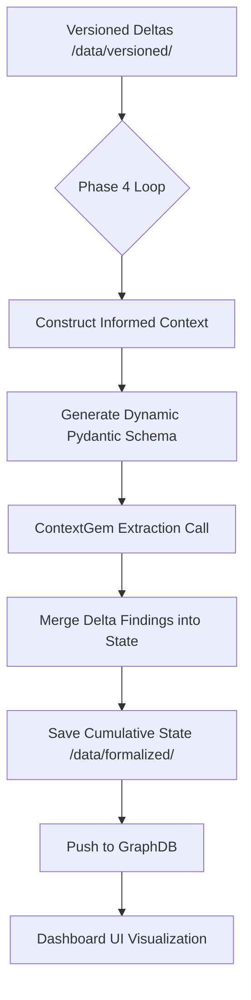

# Phase 4 Detail: Architectural Decision Formalization

Phase 4 is the "brain" of the DISCO-ML pipeline. It transforms unstructured GitHub discussion fragments (Versioned Deltas) into structured, versioned Architectural Design Decision (ADD) records.

## 1. Overview
The goal of this phase is to perform **Informed Incremental Extraction**. Instead of processing a massive discussion thread in one go, we process it comment-by-comment, providing the LLM with the "current state" of the decision as context.

## 2. Core Technology: ContextGem v0.22.0
We utilize **ContextGem** as the extraction framework. It provides:
- **Pydantic-based Tool Calling**: Automatically generates JSON schemas for LLM function calling.
- **Concept-Based Extraction**: Allows us to define `StringConcept` for simple fields and `JsonObjectConcept` for complex nested data like Arguments.

## 3. The Extraction Workflow

### Step A: Informed Context Preparation
For every version $v_n$, the system constructs a context string consisting of:
- **CURRENT DECISION**: The consolidated technical choice identified in versions $v_1$ to $v_{n-1}$.
- **FULL KNOWLEDGE BASE**: The complete JSON state of all previously extracted concepts.
- **NEW FRAGMENT**: The specific author, timestamp, and text content of the current version.

### Step B: Dynamic Schema Generation
The `build_schema_from_config` utility reads `config.yaml` and dynamically creates Pydantic models. 
> [!IMPORTANT]
> **Mandatory Descriptions**: To support strict LLM providers (like `rwth_gpt`), every field must have a description. We extract these from hints in the YAML: `field_name: "type (Description string)"`.

### Step C: Decision-Centric Stance Classification
Classification is performed during the extraction of `Argument` objects. The LLM evaluates the new text against the `CURRENT DECISION` using the following criteria:
- **Pro**: Supports the decision or offers constructive paths forward.
- **Con**: Disagrees with the decision or identifies blockers.
- **Neutral**: Technical discussion, inquiries, or social/procedural updates that take no clear stance.

### Step D: State Merging
New "Delta" findings are merged into the cumulative state:
- **Single-value fields** (`Decision`, `Rationale`, `Description`, `Cost`, `Risk`) are updated only if the LLM returns a non-null, refined value.
- **Collection fields** (`Argument`) are appended with new unique items.
- **Metadata** (`Issue`) is extracted once at $v_1$ and preserved thereafter.

---

## 4. Pipeline Data Flow



## 5. Technical Implementation: The Prompt structure

The LLM receives a prompt structured as follows:

```markdown
### CURRENT KNOWLEDGE BASE (v1 to v(n-1))
CURRENT DECISION: [The evolved consensus]
FULL STATE: { "Issue": ..., "Decision": ..., "Argument": [...] }

### NEW FRAGMENT (TO EXTRACT FROM)
Author: @username
Timestamp: 2025-01-01T10:00:00
Content: "I disagree with using a CABlock here, it adds too much complexity."

### TASK
Extract technical arguments and weigh them against the CURRENT DECISION.
```

---

## 6. Directory Structure
- `phase4_formalize.py`: Main execution script and merging logic.
- `config.yaml`: Central source of truth for schemas and stance definitions.
- `data/formalized/`: JSON output per version, used for UI state sliders.
