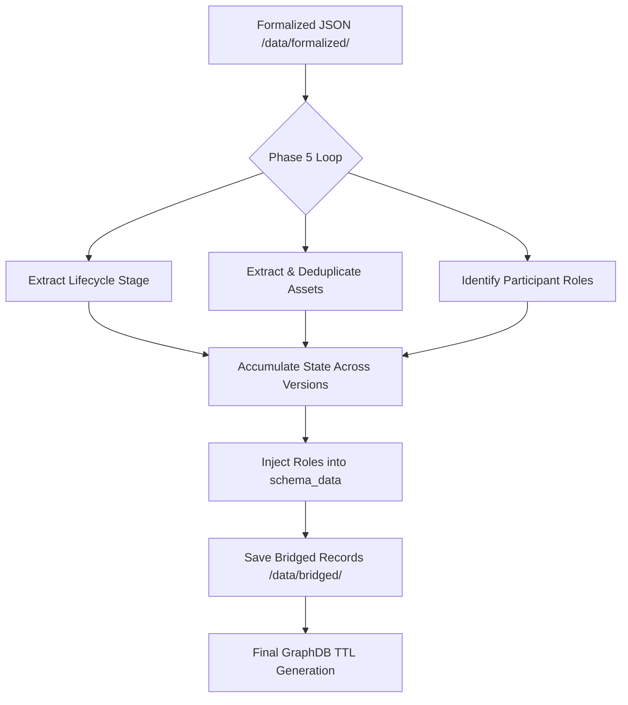

# Phase 5 Detail: MLOps Ontology Bridge

Phase 5 is the final extraction step in the DISCO-ML pipeline. It enriches the formalized architectural records from Phase 4 with deep MLOps lifecycle context, asset tracking, and professional role identification.

## 1. Overview
The goal of this phase is to "bridge" technical design decisions to the formal MLOps ontology. It classifies the project state using established industry frameworks (CRISP-ML(Q)) and maps the participants to their technical roles.

## 2. Core Technology: ContextGem & CRISP-ML(Q)
We continue to use **ContextGem** for robust, schema-driven extraction. The classification logic is grounded in:
- **CRISP-ML(Q)**: A standard lifecycle model for Machine Learning projects.
- **Dynamic Role Mapping**: Identifying authors as Data Engineers, Scientists, or ML Engineers based on their technical contributions.

## 3. The Enrichment Workflow

### Step A: Hybrid Input Context
Phase 5 consumes two sources for every version:
1. **Formalized JSON (Phase 4)**: The high-level summary of the decision, rationale, and arguments so far.
2. **Raw Fragment (Phase 3)**: The original, un-summarized text to preserve subtle technical clues about author roles and asset locations.

### Step B: Lifecycle Stage Classification
The LLM classifies the decision into one of the following CRISP-ML(Q) stages:
- **Modeling Development**: Architecture choices, training strategies.
- **Model Deployment**: CI/CD, serving, API design.
- **Data Preparation**: Feature engineering, data collection.
- **Monitoring & Maintenance**: Drift detection, retraining.
- (And others: Initiation, Evaluation, Miscellaneous, Uncertain).

### Step C: Cumulative Asset Inventory
Assets mentioned in the discussion (Models, Datasets, PRs, Layers) are tracked across the entire issue lifecycle:
- **Persistence**: Assets extracted in `v1` are carried forward to all subsequent versions.
- **Deduplication**: Assets are merged based on Name (case-insensitive) and Type.
- **Location Enrichment**: If a version provides a new URL or file path for an existing asset, the entry is automatically updated.

### Step D: Multi-Author Role Identification
Unlike Phase 4, Phase 5 identifies the **professional role** of every contributor:
- **Cumulative Role Map**: Maintains a global dictionary of `username -> role`.
- **Deep Injection**: Roles are injected directly into the `Issue` author field and every individual `Argument` entry in the `schema_data`.

---

## 4. Pipeline Data Flow



## 5. Technical Implementation: Dynamic Schema

Phase 5 utilizes the `build_schema_from_config` utility to maintain consistency with Phase 4. All enrichment rules are defined in `config.yaml` under `bridge_schema`:

```yaml
bridge_schema:
  - name: "lifecycle_stage"
    description: "MLOps lifecycle stage based on CRISP-ML(Q)..."
    singular_occurrence: true
  - name: "assets"
    type: "JsonObjectConcept"
    structure:
      name: "str (Name of the asset)"
      asset_type: "str (Model, Dataset, etc.)"
      location: "str (URL or file path)"
```

---

## 6. Directory Structure
- `phase5_bridge.py`: Main execution logic, state accumulation, and role injection.
- `config.yaml`: Central source of truth for lifecycle stages and role definitions.
- `data/bridged/`: Enriched JSON output, serving as the final source for the Knowledge Graph.
- `prompts/bridge_mapping.txt`: The prompt template used for the ontology mapping.
